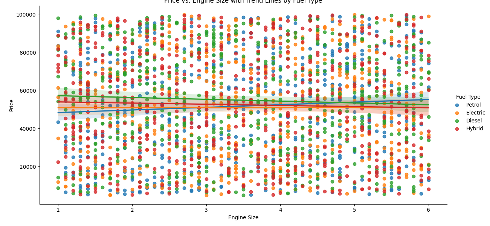

# Car Price Modeling and Analysis


## Description

This project tests my Data Science and Machine Learning skills using a [car dataset from Kaggle](https://www.kaggle.com/datasets/zafarali27/car-price-prediction/data). The main goal is to answer pricing-related questions posed by the dataset, assess its quality, and evaluate how useful it can be for building predictive models.


## Table of Contents
- [Introduction](#introduction)
- [Features](#features)
- [Analysis](#analysis)
- [Installation](#installation)
- [Challenges and Learnings](#challenges-and-learnings)
- [Contributing](#contributing)
- [License](#license)

## Introduction

In Machine Learning and A.I., the effective use of data handling and modeling is crucial. A well-structured approach to these steps can lead to impressive results.

This project explores how various features, such as price, model, condition, mileage, engine size, and year, influence car prices. Through this exercise, I aim to:
- Build predictive models using the data.
- Answer key questions about car pricing trends.
- Test the quality and usability of the dataset.

## Analysis
- For this section I'll be answering the questions the dataset proposes
### **Part 1 Understanding the Features**

 **Brand and Model: Analyze how different brands and models influence car prices. Are luxury brands significantly more expensive than economy brands?**

- It´s counterintuitive, but the difference between car prices alongside brands seem very close; Tesla, Ford and Mercedes the highest and the lowest prices, though BMW seems to have on avarage te highest prices
```Python
# Set the width and height of the figure
plt.figure(figsize=(16, 6))
sns.boxplot(data=df, x='Model', y='Price', hue='Brand')
plt.title('Boxplot of Car Prices by Model and Brand')
plt.xticks(rotation=90)  # Rotate x-axis labels if there are many models
```


```Python
# Set the width and height of the figure
plt.figure(figsize=(16,6))
sns.boxplot(df, y='Price', hue='Brand')
plt.title('Boxplot of Car Prices by Brand')
plt. savefig("results/BrandComparison.png")

```


 **Year of Manufacture: Discuss the depreciation of car prices over time. How does the year affect pricing, and are there notable trends for specific brands?**

- Not really as it seems below, the prices have consident ups and downs, cases like Toyota that has the lowest price at early 2010s recovered its price the following years.
```Python
plt.figure(figsize=(16, 6))
sns.lineplot(data=df, x='Year', y='Price', hue='Brand', estimator='mean')
plt.title('Average Car Price Depreciation Over Time by Brand')
plt.xlabel('Year of Manufacture')
plt.ylabel('Average Price')
```


 **Engine Size: Explore the relationship between engine size and price. Does a larger engine correlate with a higher price, and how does this vary across different fuel types?**

- The difference below indicates that theres not much significant changes in price througought and correlation with engine size 
```Python
plt.figure(figsize=(16, 6))
sns.lmplot(data=df, x='Engine Size', y='Price', hue='Fuel Type', aspect=2, height=6)
plt.title('Price vs. Engine Size with Trend Lines by Fuel Type')
```




 **Fuel Type: Evaluate how fuel types (Petrol, Diesel, Electric, Hybrid) impact pricing. Are electric vehicles priced higher due to their technology, or do they vary based on other factors?**

- Apparently not so much, as seem on the boxplot I made it seems like Diesel has the highest price amongst; Electric, Hybrid and Petrol, also Hybrid and Petrol seem pretty high, but it doesnt seem a significant difference

- There´s no aparent difference on the Box plot
```Python
# Set the width and height of the figure
plt.figure(figsize=(16,6))
sns.boxplot(df, y='Price', hue='Fuel Type')
plt.title('Boxplot of Car Prices by Fuel Type')
```


**Transmission: Discuss if manual or automatic transmissions affect car pricing, especially in different markets or demographics.**

- There´s no aparent difference on the Box plot
```Python
# Set the width and height of the figure
plt.figure(figsize=(16,6))
sns.boxplot(df, y='Price', hue='Transmission')
plt.title('Boxplot of Car Prices by Transmission')
```


### **Part 2 prediction and modeling**
 **Machine Learning Models: Explore which models (e.g., linear regression, decision trees, or ensemble methods) are best suited for predicting car prices using this dataset.**
- The models did terribly due to the lack of correlation between the data, this is where I learned about using tags and one-hot-encoding for each model, for this exersice I did the following models with their respective metrics, for this work i used RMSE, MSE, R² and Mae.

- Linear Regression:
```
RMSE: 27828.565634151106,
MSE: 774429065.254256
R²: -0.022738580424332522
Mean Absolute Error on test data: 24051.70
```
- Desicion Trees:
```
RMSE: 38548.46
R²: -0.89
Mean Absolute Error on test data: 31697.27
```
- Random Forest
```
RMSE: 38548.46
R²: -0.89
Mean Absolute Error on test data: 31697.27
```
- XGBoost
```
Mean Absolute Error: 25620.73
Root Mean Squared Error: 30973.23
R² Score: -0.23
```
- Neural Networks
```
Mean Absolute Error: 52408.90
Root Mean Squared Error: 59411.30
R² Score: -3.51
```

- The modeling as you can see isnt very good, so my first impressions are that this dataset is not optimal for modeling, but yet, somewhat good to finding some features at best

 **Feature Importance: Discuss the importance of different features in predicting price. Which features contribute most to the price prediction accuracy, and how can feature selection improve the model?**

- From analysis i wouldn't be able to understand the most important features, but XGBoost gave me the necessary tools to troubleshoot and understand what are the most important features in the data set, being Mileage, Year and Engine Size this is very telling, though I was only able to reach this answer thanks to modeling which wasnt very good

```Python
plt.figure(figsize=(10, 18))  # Set the figure size

# Plot importance
xgb.plot_importance(xgb_model, 
                    importance_type='weight',  # You can choose 'weight', 'gain', or 'cover'
                    max_num_features=20,  # Show only the top 20 features
                    title='Feature Importance',
                    xlabel='F score',
                    ylabel='Features',
                    color='skyblue')

plt.tight_layout()  # Adjust layout to prevent clipping of tick-labels
plt.show()
```


### **Part 3 Market Trends and Insights**

**Price Distribution: Analyze the distribution of car prices. Are there a lot of high-priced luxury cars, or is the dataset skewed towards more affordable options?**
- As there was no way to accurately know which car was Luxury due to non-Luxury brands having Luxury models, I decided to make a new column and manually add which one was Luxury.

```Python
# Get unique models
unique_models = df['Model'].unique()

# Print each model
for model in unique_models:
    print(model)
```
Output:
```
Model X
5 Series
A4
Model Y
Mustang
Q7
Q5
Civic
Explorer
Model 3
Fiesta
X3
GLA
A3
X5
C-Class
E-Class
CR-V
Camry
Accord
GLC
Corolla
Fit
Model S
Prius
3 Series
RAV4
Focus
```
- Then I added them manually
```Python
# List of luxury models
luxury_models = ['Model X', 'Model S', '5 Series', 'A4', 'Q7', 'Q5', 
                 'C-Class', 'E-Class', 'X3', 'GLA', 'X5', 'Q8', 
                 'A8', 'Porsche 911', 'Lexus ES', 'Tesla Model 3', 
                 'Civic Type R', 'Accord Sport', 'Mustang GT']  # Add more as needed

# Create a new column 'Luxury' based on the model
df['Luxury'] = df['Model'].apply(lambda x: 'Yes' if x in luxury_models else 'No')
# Set the figure size
plt.figure(figsize=(16, 6))

# Create a boxplot to compare price distributions
sns.boxplot(data=df, x='Luxury', y='Price', palette={'Yes': 'gold', 'No': 'lightblue'})
plt.title('Price Distribution of Luxury vs. Non-Luxury Cars')
plt.xlabel('Luxury Status')
plt.ylabel('Price')

# Show the plot
plt.show()
plt.savefig("results/LuxuryComparison.png")
```


- I see no significant difference, so no, it doesn't seem to be skewed.


**Mileage vs. Price: Investigate the correlation between mileage and price. How does higher mileage affect pricing, and is there a threshold where price reduction becomes significant?**
- 
```python
plt.figure(figsize=(10, 6))

# Scatter plot with regression line
sns.regplot(x=df['Mileage'], y=df['Price'], scatter_kws={'alpha':0.5}, line_kws={"color":"red"})
plt.title('Mileage vs. Price')
plt.xlabel('Mileage (e.g., km or miles)')
plt.ylabel('Price (e.g., currency)')
plt.axvline(x=100000, color='gray', linestyle='--', label='Mileage Threshold (100,000 km)')  # Example threshold
plt.legend()

plt.savefig("results/mileagevsprice.png")
plt.show()

```


**Condition Impact: Discuss how the condition of the car (New, Used, Like New) influences the price. Are there significant price drops for used cars compared to new ones?**
- 
```python
# Set the width and height of the figure
plt.figure(figsize=(16,6))
sns.boxplot(df, y='Price', hue='Condition')
plt.title('Boxplot of Car Prices by Condition')
plt.savefig("results/pricesbycondition.png")
```


### **Part 4 Regional Analysis**

- **<span style="color:red">(In this database there's no regional data)</span>**

### **Part 5  Future Developments and Trends**

**Electric Vehicle Market: With the rise of electric vehicles, discuss how this dataset reflects the growing demand and pricing trends for EVs compared to traditional fuel cars.**
- There's no aparent difference between Fuel Type prices, therefore there's no clear trend by now
```python
# Set the width and height of the figure
plt.figure(figsize=(16,6))
sns.boxplot(df, y='Price', hue='Fuel Type')
plt.title('Boxplot of Car Prices by Fuel Type')
```

**Impact of Technology: Consider how advancements in technology, safety features, and autonomous driving capabilities might influence future pricing.**

- There's no aparent difference between Fuel Type prices, therefore there's no clear trend by now, tho there's a tiny trend of cars being less expensive from the last10 years
```python
# Set the width and height of the figure
average_price_per_year = df.groupby('Year')['Price'].mean()

# Plot the average price by year
plt.figure(figsize=(12, 6))
plt.plot(average_price_per_year.index, average_price_per_year.values, marker='o', color='skyblue')
plt.title('Average Car Price by Year')
plt.xlabel('Year')
plt.ylabel('Average Price')
plt.grid()
plt.xticks(rotation=45)
plt.show()
plt.savefig("results/AvgPriceYear.png")

```


## Features

- Data Analysis and Understanding
- Modeling:
  - Linear Regression
  - Decision Trees
  - Random Forest
  - XGBoost
  - Neural Networks


## Installation

Follow these steps to set up the project:

```bash
# Clone the repository
git clone https://github.com/Zero5896/Car_price_modeling/edit/main/README.md

# Navigate to the project directory
cd Car_price_modeling

# Install the necessary dependencies
pip install -r requirements.txt

```


## Challenges and Learnings

1. **Patience**: This project taught me the importance of problem-solving and that sometimes you need to let a problem rest and return with a fresh perspective.
   
2. **Model Performance Insights**: This was my first experience encountering performance issues across various modeling techniques, including linear regression and decision trees. I learned that even when models fail, they can lead to important questions about the data and its features.

3. **The Power of Smart Questions**: Early in my learning, I focused on applying models without fully understanding each independent variable. This project made me realize that the questions I posed about the problem guided me to explore new solutions and refine my approach.

4. **Value of Visuals and Code in README**: Including images, code snippets, and examples in the README proved beneficial for my understanding and could enhance clarity for others as well.

5. **Introduction to XGBoost**: I started this project with limited knowledge of XGBoost. Frustrated by the lack of success with initial modeling techniques, I learned XGBoost to troubleshoot. Although it didn't solve my issues, I gained a valuable new technique for my toolkit.
6. **Manually preprocess and handle the dateset**: For some problems I did manually encode variables and assigned Luxury Value to each model, due to Non-Luxury Brands having Luxury models that could be misleading.

This project helped me solidify my understanding of data preprocessing, model evaluation, and how to troubleshoot common machine learning problems.

## Contributing
Feel free to contribute! Please fork the repository and submit a pull request. You can also open an issue if you find a bug or have a suggestion.

## License

This project is licensed under the MIT License. See the LICENSE file for more details.
